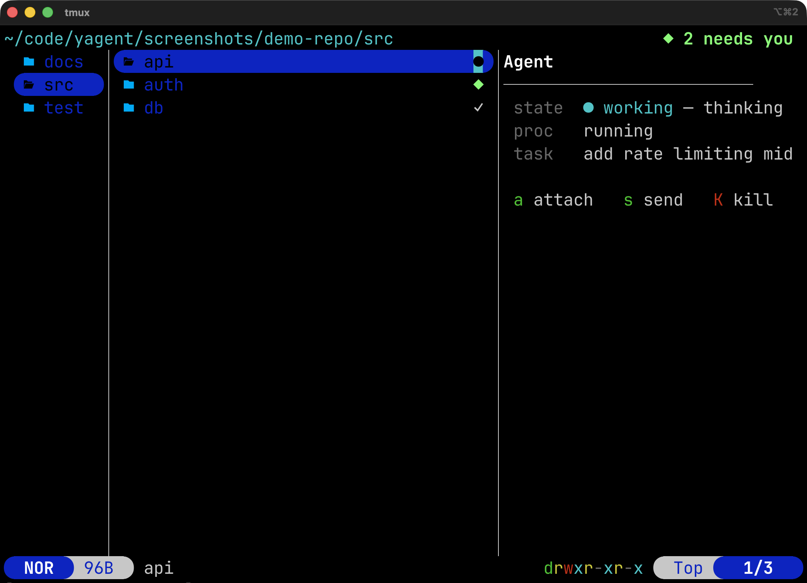
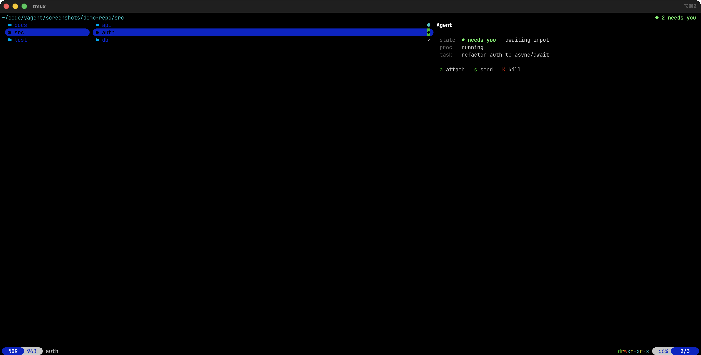
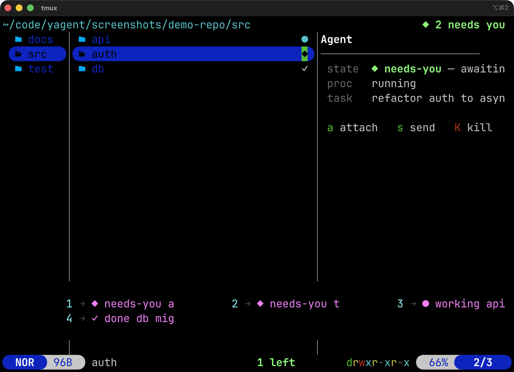

# yagent

**An agent-aware file manager.** `yagent` turns [yazi](https://yazi-rs.github.io/) into a
control panel for [Devin CLI](https://docs.devin.ai/) local agents: browse your code like
always, but now any folder can have live agents *attached* to it — and you can see at a glance
which are working, which are done, and which need you.

> Status: v0.2.x — feature-complete, in polish. Real-time updates, stale-lock cleanup, and `ya pkg` install supported.

## Screenshots

**Browsing your repo — agents as an ambient layer over the file tree:**



*`api` is working (● cyan), `auth` needs you (◆ green), `db` is done (✓ gray). The header always shows how many agents need attention.*

**An agent needs your input — hover it to see what it wants:**



*Press `a` to drop into the agent's REPL and reply, then detach and keep browsing.*

**`g a` — Agents Overview, sorted by urgency:**



*All agents ranked by urgency. Press the number key to jump to that folder.*

## Why

When you run several local Devin agents, the hard part isn't starting them — it's *knowing
what they're doing without babysitting them*. `yagent` makes agents a first-class, ambient
layer over the file tree you already navigate, so you can fire-and-forget and get pulled back
exactly when an agent needs you.

## Mental model: agents are *attachments*

A folder is the unit. An agent is something **attached** to a folder — like a git status or a
file size. A folder can have **0, 1, or many** agents attached. You never leave the
file-browsing mental model; agents are a second navigable layer over the same tree.

- **Folder axis** (`j`/`k`): normal browsing. Folders with agents get a colored glyph + a `⚑`
  count badge.
- **Agent axis** (`Tab`): the preview column becomes the agent panel; `j`/`k` moves through the
  agents attached to the hovered folder.
- `Enter` always opens the folder (unchanged). Agents are reached via the parallel gesture.

## What it looks like

```
┌──────────────────────────────────────────────────────────────────────┐
│  my-repo  ◆ 2 needs you                                   9.2 MiB  │  ← header counter
├──────────┬───────────────────────────────┬─────────────────────────┤
│ .git     │                               │ Agent                   │
│ src   ◆  │                               │ ─────────────────────── │
│ test  ○  │  (normal yazi file list)      │  state   ◆ needs-you   │  ← preview panel
│ docs  ·  │                               │  proc    running        │
│ ...      │                               │  task    refactor auth  │
│          │                               │                         │
│          │                               │  a attach  s send  K kill│
└──────────┴───────────────────────────────┴─────────────────────────┘
   ↑                      ↑                           ↑
   folder list      normal browsing              agent panel
   with glyphs      (unchanged)                 (when you hover a
   (◆ ○ ·)                                         folder with an agent)
```

Folders with agents get a small colored glyph in the file list:
- `●` cyan = working | `◆` green = needs you | `○` dim = idle | `✓` gray = done | `·` dim = dead | `✕` red = error

The header counter (`◆ 2 needs you`) is always visible — even when you're deep in another folder.

## Status model

Five states, optimized for one question — *"does this need me?"*

| State           | Color       | Meaning                                   | Your move          |
|-----------------|-------------|-------------------------------------------|--------------------|
| **Working**     | cyan        | Thinking / building, making progress      | ignore, keep going |
| **Needs you**   | bold green  | Finished a turn, or asking permission     | **jump in**        |
| **Idle**        | dim         | Spinning up, nothing yet                  | wait               |
| **Done**        | gray        | Session ended / detached & complete       | review or clear    |
| **Error**       | red         | Crashed / failed                          | investigate        |

"Needs you" is the hero state — it drives the terminal bell, the header counter, and sort
priority in the Agents Overview.

## Keymap

| Key   | Action                                                            |
|-------|-------------------------------------------------------------------|
| `N`   | New agent on hovered folder -> task prompt -> launch + attach     |
| `a`   | Attach to the agent on the hovered folder (resume its REPL)       |
| `s`   | Send a one-off prompt to a running agent                          |
| `K`   | Kill agent (confirm)                                              |
| `c`   | Clear a finished agent — remove done / dead / error state       |
| `r`   | Refresh agent state (also auto-prunes stale locks)                |
| `g a` | Agents Overview — key menu of all agents, sorted by "needs you"   |
| `Enter` | Open folder (unchanged)                                         |
| `Tab` | Enter / leave the agent axis — *planned*                          |
| `I`   | New **isolated** agent (shadow worktree + sandbox) — *v0.3*       |

## Tutorials

### Tutorial 1: Spawn, browse, and get summoned back

**Step 1 — You spot a folder that needs work**

```
┌────────────────────────────────────────────────────┐
│  my-repo                                             │
├──────────┬───────────────────────────────┬───────────┤
│ .git     │                               │           │
│ src      │  README.md                    │           │
│ auth  ▶  │  main.rs                      │           │
│ test     │  lib.rs                       │           │
│ docs     │  Cargo.toml                   │           │
└──────────┴───────────────────────────────┴───────────┘
```

You're hovering `src/auth`. It needs refactoring.

**Step 2 — Press `N` and describe the task**

```
┌────────────────────────────────────────────────────┐
│  Task for agent in auth:                           │
│  ┌──────────────────────────────────────────────┐  │
│  │ refactor the login flow to use async/await   │  │
│  └──────────────────────────────────────────────┘  │
│                    [ Enter ]  [ Cancel ]             │
└────────────────────────────────────────────────────┘
```

**Step 3 — The agent launches and you drop into its REPL**

```
$ devin
> refactor the login flow to use async/await
...
```

Type your message, watch it start. When you're ready to let it work alone, detach: `Ctrl-b d`.

**Step 4 — You're back in yazi. The folder now has a badge.**

```
┌────────────────────────────────────────────────────┐
│  my-repo                                             │
├──────────┬───────────────────────────────┬───────────┤
│ .git     │                               │ Agent     │
│ src   ●  │  (you keep browsing)          │ ───────── │
│ auth  ○  │                               │  state  ○ idle   │
│ test     │                               │  proc   running  │
│ docs     │                               │  task   refactor │
└──────────┴───────────────────────────────┴───────────┘
```

The badge starts as `○ idle` (spinning up), then turns `● working` as the agent thinks.

**Step 5 — The summon. The badge turns `◆` and the bell rings.**

```
┌────────────────────────────────────────────────────┐
│  my-repo  ◆ 1 needs you                            │  ← header counter appears
├──────────┬───────────────────────────────┬───────────┤
│ .git     │                               │ Agent     │
│ src   ●  │                               │ ───────── │
│ auth  ◆  │  (you're in another folder)   │  state  ◆ needs-you   │
│ test     │                               │  proc   running       │
│ docs     │                               │  task   refactor auth │
└──────────┴───────────────────────────────┴───────────┘
```

Even though you're looking at a different folder, the header counter tells you someone needs attention.

**Step 6 — Press `a` to jump back into the REPL**

The agent is waiting for your input. You reply, detach again, and keep browsing.

---

### Tutorial 2: Manage many agents at once

You have three agents running across your repo:

```
┌────────────────────────────────────────────────────┐
│  my-repo  ◆ 2 needs you                            │
├──────────┬───────────────────────────────┬───────────┤
│ .git     │                               │           │
│ api   ●  │                               │           │
│ auth  ◆  │                               │           │
│ db    ✓  │                               │           │
│ test  ◆  │                               │           │
└──────────┴───────────────────────────────┴───────────┘
```

**Press `g a` for the Agents Overview.**

```
┌────────────────────────────────────────────────────┐
│  Agents Overview                                     │
│                                                      │
│  1  ◆ needs-you   auth     refactor auth             │
│  2  ◆ needs-you   test     write integration tests   │
│  3  ● working     api      add rate limiting         │
│  4  ✓ done        db       migrate users table       │
│                                                      │
│  Press a key to reveal that folder...               │
└──────────────────────────────────────────────────────┘
```

Agents are sorted by urgency: `needs-you` first, then `working`, `idle`, `error`, `done`.

Press `1` and yazi navigates to `src/auth`. Press `a` to attach.

Later, `db` is done. Hover it and press `c`:

```
┌────────────────────────────────────────────────────┐
│  Clear this agent?                                   │
│                                                      │
│  This removes the finished agent from:               │
│  /Users/you/code/my-repo/src/db                      │
│                                                      │
│         [ Yes ]  [ No ]                              │
└──────────────────────────────────────────────────────┘
```

The `✓` disappears. Your tree stays clean.

---

### Tutorial 3: Working inside tmux

If you run yazi inside tmux (recommended for long-lived agents), attaching would nest sessions. yagent handles this automatically:

- Press `N` or `a` → yagent calls `tmux switch-client` instead of `attach`
- You're now in the agent's tmux session, talking to Devin directly
- When you're done, press `Ctrl-b L` to switch back to yazi (last session)

```
# Your tmux session tree might look like:
├─ yazi-main     (yagent running here)
├─ yagent-abc123 (agent on src/auth)
├─ yagent-def456 (agent on src/api)
└─ yagent-ghi789 (agent on src/db, done)
```

`Ctrl-b s` shows all sessions if you ever lose track.

## How it works

```
Devin lifecycle hooks (global)  --write-->  state files
                                            ~/.local/state/yagent/<dirhash>.json
scripts/agent.sh  --tmux session per agent-->  lock  .yagent/owner.json (per folder)
                                            |
yazi plugin reads: state file + lock + `tmux has-session` + `git -C` info
   - file list -> glyph + badge        (ambient layer)
   - preview   -> agent panel          (agent axis)
   - header    -> "needs you" counter + bell
```

- **Default mode:** agents run *in-place* on the hovered folder.
- **Isolated mode (opt-in):** a hidden git worktree + `devin --sandbox`, still presented as
  attached to the original folder.
- **Backend:** one tmux session per agent; attach = drop into its REPL.
- **Status:** Devin lifecycle hooks report state; tmux liveness is the authority for "running".
- **Live updates:** `yagent` launches yazi with a unique `--client-id` and exports it to the
  agents it spawns. Each lifecycle hook pushes the new state back over yazi's DDS
  (`ya pub-to`), so badges re-color **instantly** — no polling, no manual refresh. (`r` is
  still there as a fallback.)

### Attaching, inside or outside tmux

- **Outside tmux:** `a` (or `N`) suspends yazi and drops you into the agent's REPL; detach
  (`Ctrl-b d`) to return.
- **Inside tmux:** attaching would nest, so yagent instead `switch-client`s your tmux to the
  agent's session. Return to yazi with `Ctrl-b L` (last session) or `Ctrl-b s` (session list).

## Requirements

- [yazi](https://yazi-rs.github.io/) (with the BETA plugin/entity API)
- [Devin CLI](https://docs.devin.ai/) (`devin`)
- `tmux`
- `git`

## Install

### Quick start (isolated profile)

Does not touch your existing yazi config:

```sh
./install.sh                      # installs Devin lifecycle hooks + scripts
export PATH="$PWD/bin:$PATH"       # put the launcher on your PATH
yagent ~/code/your-repo            # open it on a repo
```

`install.sh` installs the Devin lifecycle hooks into your user-level Devin config (backing it
up first, and never clobbering existing hooks). `bin/yagent` launches yazi with an **isolated**
`YAZI_CONFIG_HOME` that wires in the plugin automatically.

### Integrate into your existing yazi config

```sh
# 1. Install the plugin
ya pkg add adames-cognition/yagent:devin-agent

# 2. Install Devin hooks (required for status reporting)
./install.sh

# 3. Wire it into your yazi config
```

In your `~/.config/yazi/init.lua`:

```lua
require("devin-agent"):setup()
```

In your `~/.config/yazi/keymap.toml` (add the actions you want):

```toml
[[mgr.prepend_keymap]]
on  = "N"
run = "plugin devin-agent -- new"
desc = "yagent: new agent on hovered folder"

[[mgr.prepend_keymap]]
on  = "a"
run = "plugin devin-agent -- attach"
desc = "yagent: attach to agent"

[[mgr.prepend_keymap]]
on  = "s"
run = "plugin devin-agent -- send"
desc = "yagent: send to agent"

[[mgr.prepend_keymap]]
on  = "K"
run = "plugin devin-agent -- kill"
desc = "yagent: kill agent"

[[mgr.prepend_keymap]]
on  = "c"
run = "plugin devin-agent -- clear"
desc = "yagent: clear finished agent"

[[mgr.prepend_keymap]]
on  = "r"
run = "plugin devin-agent -- refresh"
desc = "yagent: refresh agent state"

[[mgr.prepend_keymap]]
on  = ["g", "a"]
run = "plugin devin-agent -- overview"
desc = "yagent: agents overview"
```

In your `~/.config/yazi/yazi.toml`:

```toml
[[plugin.prepend_fetchers]]
url   = "*/"
run   = "devin-agent"
group = "yagent"

[[plugin.prepend_previewers]]
url = "*/"
run = "devin-agent"
```

## Layout

```
.
├── devin-agent.yazi/            # yazi plugin (self-contained, installable via ya pkg)
│   ├── main.lua                 #   fetcher + linemode badge + previewer + actions
│   ├── README.md
│   ├── LICENSE
│   └── scripts/                 #   shell helpers bundled with the plugin
│       ├── agents.sh            #     query status: list | get | prune
│       ├── agent.sh             #     manage an agent: start / attach / send / kill
│       ├── statedir.sh          #     dir -> state-file path helper
│       └── worktree.sh          #     isolated-mode shadow worktrees (v0.3)
├── bin/yagent                   # launcher: isolated yazi profile
├── hooks/
│   ├── devin-status-hook.sh     # Devin lifecycle hook dispatcher
│   └── hooks.json
├── config/                      # isolated yazi profile (used by bin/yagent)
│   ├── yazi.toml
│   ├── keymap.toml
│   ├── init.lua
│   └── theme.toml
├── scripts -> devin-agent.yazi/scripts   # backward-compat symlink
├── install.sh                   # install hooks + scripts globally
└── README.md
```

## Troubleshooting

| Symptom | Likely cause | Fix |
|---------|-------------|-----|
| "Scripts not found" toast | Plugin installed via `ya pkg` but `install.sh` not run | Run `./install.sh` to set up hooks and global scripts |
| "yagent needs tmux" | tmux not on PATH | `brew install tmux` (or your package manager) |
| "yagent needs devin" | Devin CLI not on PATH | Follow [docs.devin.ai](https://docs.devin.ai/) to install |
| Agent badge stays after process died | Stale lock wasn't pruned yet | Press `r` (refresh) — it auto-prunes dead sessions |
| No live badge updates | `YAGENT_YAZI_ID` not propagated | Make sure you launch agents through yagent (not a separate terminal) |
| Hooks not firing | Another tool already owns `hooks` in Devin config | Merge `hooks.json` manually into `~/.config/devin/config.json` |

## Roadmap

- **v0.1 (MVP):** in-place agent on hovered folder, glyphs + badges, agent panel,
  `N`/`a`/`s`/`K`/`r`, hook-driven status.
- **v0.2 (done):** real-time badge updates via DDS push; nested-tmux attach via `switch-client`;
  "needs you" bell + header counter; live preview-panel refresh; `g a` Agents Overview.
- **v0.2.x (done):** robustness (stale-lock pruning, missing-binary checks, `clear` action);
  `ya pkg` packaging (self-contained plugin with bundled scripts).
- **v0.3:** isolated mode (shadow worktrees), multiple agents per folder, `--sandbox`,
  conflict hints.
- **v0.4:** themeable colors/config, desktop notifications, docs.

## License

MIT — see [LICENSE](LICENSE).

---

**Test PR for reproduction testing**
